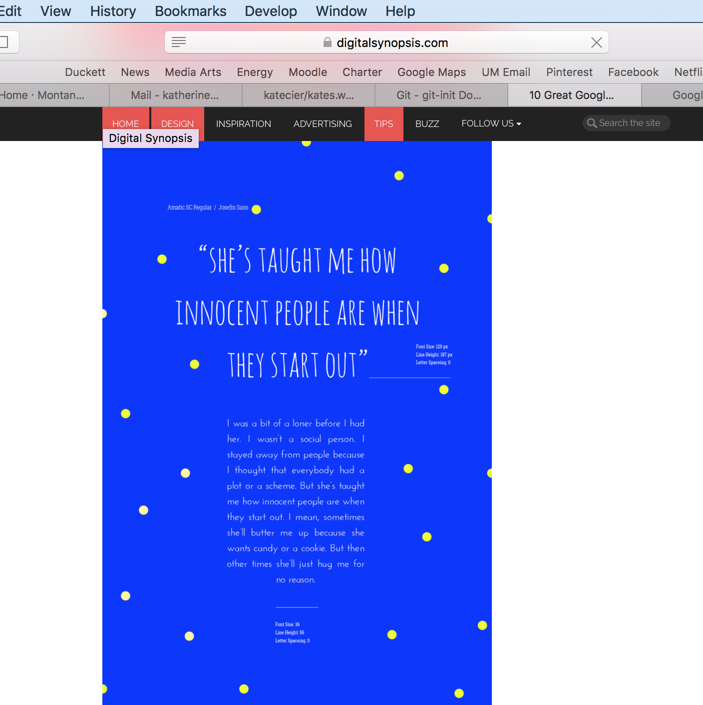

#Summary

The final project was more fun to do because of the freedom we were given in designing the site. I enjoyed picking out the fonts and color schemes. I got my basic idea for fonts from an online example but decided to change the serif a little to make it more clean and professional looking in the body.

I decided I liked the feel of the hero and parallex elements we learned about so I decided to keep sort of the same basic model as last week.  I made a travel blog site, and wanted the main focus to be on pictures, so hero worked well in displaying them.

I encountered some problems creatig a new repository on github because I wan't able to get source tree to connect to it as the master.  Eventually I was able to do it manually.

Because I used a similar design to my last projct, I was able to use the same RWD elements. I also added a feature where you scroll over the photos and it gives a description.

Content wise, I created four tabs to seperate the site and each would be under a title displayed over a scrolling parallex photo. I chose to make one of the photo's height short to act as simply a seperation.
